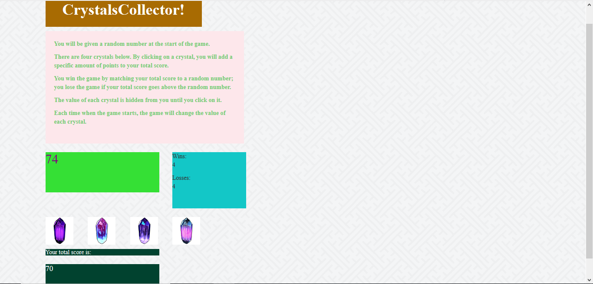

# Crystal Game

An interactive game which utilizes JavaScript and jQuery, and involves clicking on crystals to attain a certain number.

## How to Use

User starts the game via the GitHub Pages [link](https://wespres1990.github.io/Crystal-Game/).

Open opening the game, there are four crystals displayed as buttons on the page, and the player will be shown a random number at the start of the game. When the player clicks on a crystal, it will add a specific amount of points to the player's total score, and this amount is hidden until the player clicks the crystal. Each time a crystal is clicked, the player's score counter is updated.

The player wins if their total score matches the random number from the beginning of the game, and loses if their score goes above the random number.

The game restarts whenever the player wins or loses. When the game begins again, the player is given a new random number and all of the crystals will have four new hidden values. Additionally, the user's total score (and score counter) will reset to zero.

### Technologies Used

Languages - HTML5, CSS4, Bootstrap, JavaScript, jQuery

Text Editor - VS Studio

## Preview

### Game in Progress
- - - -

## Contributing

Please feel free to branch off with tweaks and making a repo; open to suggestions for improvement!

## Future Development

* Move game to middle of the page
* Adding more styling, including a picture (or pictures) for the background

## Authors

* **Wesley Hutchins** - [Github](https://github.com/WesPres1990)